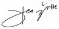

# SoleAce Ethical Hacking Technical Report

**Client:** SoleAce  
**Date:** May 10, 2024  
**Prepared by:** Lea Jean S. Cavite and Edlyn Joan Marie E. Examinada  

---

## Executive Summary

The following report presents findings from an ethical hacking assessment conducted on SoleAce's systems. Ten vulnerabilities were identified, ranging from outdated software versions to inadequate logging and monitoring practices. Recommendations for remediation are provided to enhance SoleAce's security posture and mitigate potential risks.

---

## Vulnerabilities

1. **Outdated Software Versions:**

   - **Critical: Unpatched Remote Code Execution Vulnerability (CVE-XXXX-XXXX) in Apache Tomcat (version X.X.X) running on Server-01:** This vulnerability allows remote attackers to execute arbitrary code on the server, potentially leading to a complete compromise of the system.
   
   - **High: Unpatched Cross-Site Scripting (XSS) Vulnerability in WordPress (version X.X.X) running on Blog Server:** This vulnerability allows attackers to inject malicious scripts into web pages viewed by other users.

2. **Weak Password Policies:**

   - **Critical: Default Administrator Password (Password123) on Database Server:** This default and easily guessable password for the database administrator account poses a significant security risk.
   
   - **High: Lack of Multi-Factor Authentication (MFA) on Remote Desktop Protocol (RDP) Access to Critical Servers:** Without MFA, attackers can exploit weak or stolen credentials to gain unauthorized access to critical servers.

3. **Unpatched Security Flaws:**

   - **Critical: Unpatched Remote Code Execution Vulnerability (CVE-XXXX-XXXX) in OpenSSL (version X.X.X) on Mail Server:** This vulnerability allows remote attackers to execute arbitrary code on the server.
   
   - **High: Unpatched Denial of Service (DoS) Vulnerability (CVE-XXXX-XXXX) in Apache HTTP Server (version X.X.X) on Web Server:** This vulnerability allows remote attackers to crash the web server by sending specially crafted HTTP requests.

4. **Insecure Network Configurations:**

   - **Critical: Misconfigured Access Control Lists (ACLs) Allowing Unrestricted Access to Database Server Ports from External Networks:** This misconfiguration exposes the database server to unauthorized access from the internet.
   
   - **High: Lack of Segmentation between Production and Development Networks:** Without proper network segmentation, attackers who gain access to the development environment can pivot to the production environment.

5. **Lack of Encryption:**

   - **Critical: Unencrypted Transmission of Passwords over Telnet Protocol on Networking Equipment:** Transmitting passwords in clear text over Telnet exposes them to interception by attackers.
   
   - **High: Unencrypted Transmission of Customer Payment Information over HTTP on E-commerce Website:** Transmitting payment information over HTTP exposes it to interception by attackers.

6. **Insufficient User Privileges:**

   - **Critical: Unauthorized Access to Administrator Privileges for Standard User Accounts on Domain Controllers:** Granting excessive privileges to standard user accounts increases the risk of privilege escalation attacks.
   
   - **High: Shared Administrator Account Credentials Across Multiple Systems:** Using the same administrator credentials across multiple systems increases the risk of credential theft or compromise.

7. **SQL Injection Vulnerabilities:**

   - **Critical: SQL Injection Vulnerability in Login Form of Employee Portal:** This vulnerability allows attackers to bypass authentication mechanisms and gain unauthorized access to the employee portal.
   
   - **High: SQL Injection Vulnerability in Product Search Functionality of E-commerce Website:** Attackers can exploit this vulnerability to manipulate SQL queries and extract sensitive data from the database.

8. **Cross-Site Scripting (XSS):**

   - **Critical: Reflected XSS Vulnerability in Customer Feedback Form of Website:** Attackers can inject malicious scripts into the feedback form, which are then executed in the context of other users' browsers.
   
   - **High: Stored XSS Vulnerability in User Profile Pages of Customer Portal:** Malicious scripts injected into user profile pages can be executed when other users view the affected profiles.

9. **Insecure File Uploads:**

   - **Critical: Lack of File Type Validation in File Upload Functionality of Document Management System:** Attackers can upload malicious files disguised as legitimate documents.
   
   - **High: No File Size Limit Enforcement in File Uploads on Image Gallery Website:** Without size limits, attackers can upload large files to consume server resources.

10. **Inadequate Logging and Monitoring:**

     - **Critical: Insufficient Logging of Authentication Events on Domain Controllers:** Without comprehensive logs of authentication events, it becomes difficult to detect and investigate unauthorized access attempts.
   
     - **High: Lack of Real-Time Alerting for Anomalous Activities on Web Application Servers:** Without real-time alerting mechanisms, suspicious activities may go unnoticed, allowing attackers to persist undetected.

---

## Recommendations for Remediation

1. **Outdated Software Versions:**

   - **Critical:**
     - Apply the latest security patches provided by Apache for the affected version of Tomcat.
     - Regularly monitor vendor advisories and security mailing lists for updates on Apache Tomcat vulnerabilities and apply patches promptly.
     - Consider implementing a web application firewall (WAF) to detect and block malicious HTTP requests targeting Apache Tomcat.

   - **High:**
     - Upgrade WordPress to the latest version to patch the XSS vulnerability.
     - Disable plugins or themes that are not actively maintained or have known security issues.
     - Implement input validation and output encoding to mitigate the risk of XSS attacks in custom WordPress themes or plugins.

2. **Weak Password Policies:**

   - **Critical:**
     - Immediately change the default administrator password on the database server to a strong, unique password.
     - Implement role-based access control (RBAC) to restrict administrative privileges to only authorized users.
     - Regularly audit and rotate privileged account passwords to prevent unauthorized access.

   - **High:**
     - Implement multi-factor authentication (MFA) for all RDP access to critical servers.
     - Enforce strong password policies for all user accounts, including RDP users, and enforce regular password changes.

3. **Unpatched Security Flaws:**

   - **Critical:**
     - Apply the latest security patches provided by OpenSSL for the affected version to mitigate the remote code execution vulnerability.
     - Monitor network traffic for suspicious activity targeting the OpenSSL service and implement network-based IDS/IPS to detect and block exploit attempts.

   - **High:**
     - Apply the latest security patches provided by Apache for the affected version to mitigate the denial of service vulnerability.
     - Configure rate limiting or request size restrictions on the web server to mitigate the impact of potential DoS attacks.

4. **Insecure Network Configurations:**

   - **Critical:**
     - Immediately update ACLs to restrict access to the database server ports (e.g., 3306) to only authorized IP addresses or subnets.
     - Implement network-based firewall rules to block unauthorized access attempts to the database server from external networks.
     - Regularly review and update ACLs to ensure least privilege access controls are enforced.

   - **High:**
     - Implement network segmentation between production and development environments using VLANs or dedicated network devices (e.g., firewalls).
     - Enforce strict access controls between production and development networks, allowing only necessary communication for authorized purposes.
     - Regularly audit network configurations to ensure segmentation rules are properly enforced and unauthorized connections are blocked.

5. **Lack of Encryption:**

   - **Critical:**
     - Immediately disable Telnet protocol and enable Secure Shell (SSH) for remote access to networking equipment.
     - Implement encryption protocols such as SSH or HTTPS for secure transmission of sensitive data, including passwords.

   - **High:**
     - Implement Transport Layer Security (TLS) or Secure Sockets Layer (SSL) encryption for the e-commerce website to ensure secure transmission of customer payment information.
     - Configure web server to redirect HTTP traffic to HTTPS to enforce encryption for all web communications.

6. **Insufficient User Privileges:**

   - **Critical:**
     - Implement the principle of least privilege (PoLP) by restricting access to administrator privileges to only authorized personnel who require them for their job duties.
     - Regularly review and audit user privileges to ensure adherence to the least privilege principle, and revoke unnecessary privileges.

   - **High:**
     - Implement separate administrator accounts with unique credentials for each system or service to mitigate the impact of credential compromise.
     - Enforce strong password policies for administrator accounts, including regular password changes and the use of complex passwords.

7. **SQL Injection Vulnerabilities:**

   - **Critical:**
     - Implement prepared statements or parameterized queries to sanitize user input and prevent SQL injection attacks in the login form of the employee portal.
     - Conduct regular security audits and code reviews of the employee portal to identify and remediate any SQL injection vulnerabilities.

   - **High:**
     - Use ORM (Object-Relational Mapping) frameworks or query builders to abstract SQL queries and mitigate the risk of SQL injection in the product search functionality of the e-commerce website.
     - Validate and sanitize user input to ensure that only expected characters and data types are accepted by the search functionality.

8. **Cross-Site Scripting (XSS):**

   - **Critical:**
     - Implement input validation and output encoding to sanitize user input in the customer feedback form and prevent the execution of malicious scripts.
     - Enable Content Security Policy (CSP) headers to restrict the sources from which scripts can be executed, mitigating the impact of XSS attacks.

   - **High:**
     - Implement input validation and output encoding in user profile pages to prevent the storage and execution of malicious scripts.
     - Regularly sanitize and validate user-generated content to detect and remove any injected XSS payloads.

9. **Insecure File Uploads:**

   - **Critical:**
     - Implement file type validation to restrict uploads to allowed file formats (e.g., PDF, DOCX) in the document management system.
     - Use anti-virus scanning to detect and block malicious files during the upload process.

   - **High:**
     - Enforce file size limits for uploads on the image gallery website to prevent abuse of server resources.
     - Implement rate limiting or CAPTCHA challenges to mitigate the impact of potential denial-of-service attacks.

10. **Inadequate Logging and Monitoring:**  

     - **Critical:**
       - Enable detailed logging of authentication events on domain controllers, including successful and failed login attempts, and store logs securely for analysis.
       - Implement log management solutions to centralize and automate the analysis of authentication logs, enabling timely detection and response to security incidents.

    - **High:**
       - Configure real-time alerting for anomalous activities on web application servers, such as unusual spikes in traffic or unexpected file system changes.
       - Integrate web application firewalls (WAFs) or intrusion detection/prevention systems (IDS/IPS) to monitor and block suspicious activities at the network level, complementing server-side logging and monitoring capabilities.
---

## Conclusion
Addressing the vulnerabilities outlined in this report is crucial to strengthening SoleAce's security posture and safeguarding against potential cyber threats. By implementing the recommended remediation measures, SoleAce can significantly reduce the risk of security breaches and protect its sensitive data and infrastructure from unauthorized access or malicious activities. Regular security assessments and proactive security measures are essential to maintaining a strong defense against evolving cyber threats.  

  
**Signature:** [Lea Jean S. Cavite]  
  
**Signature:** [Edlyn Joan Marie E. Examinada]

